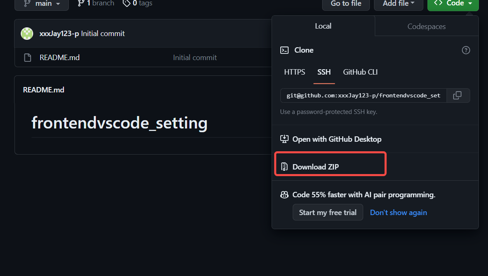
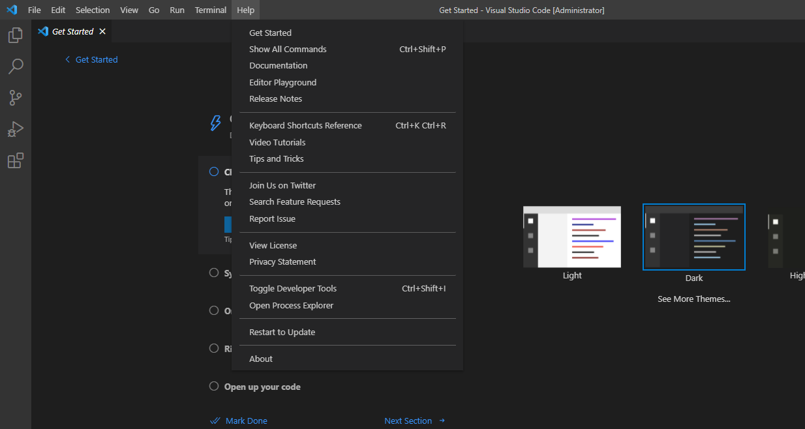
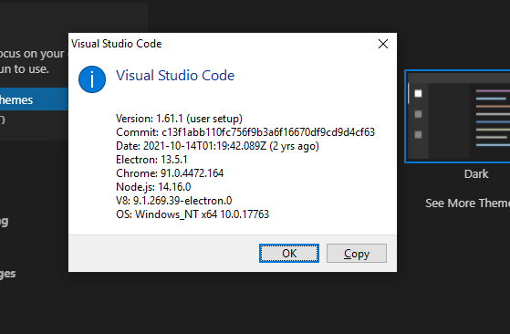
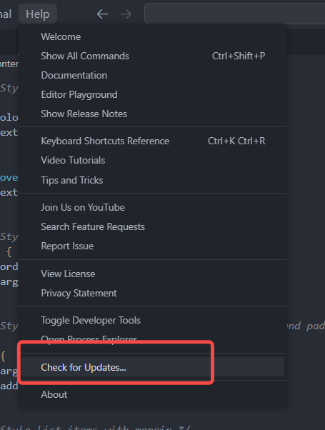
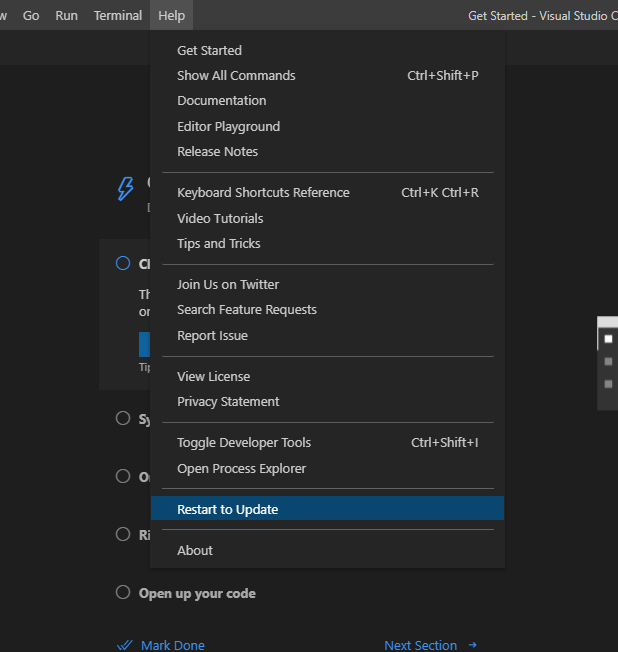
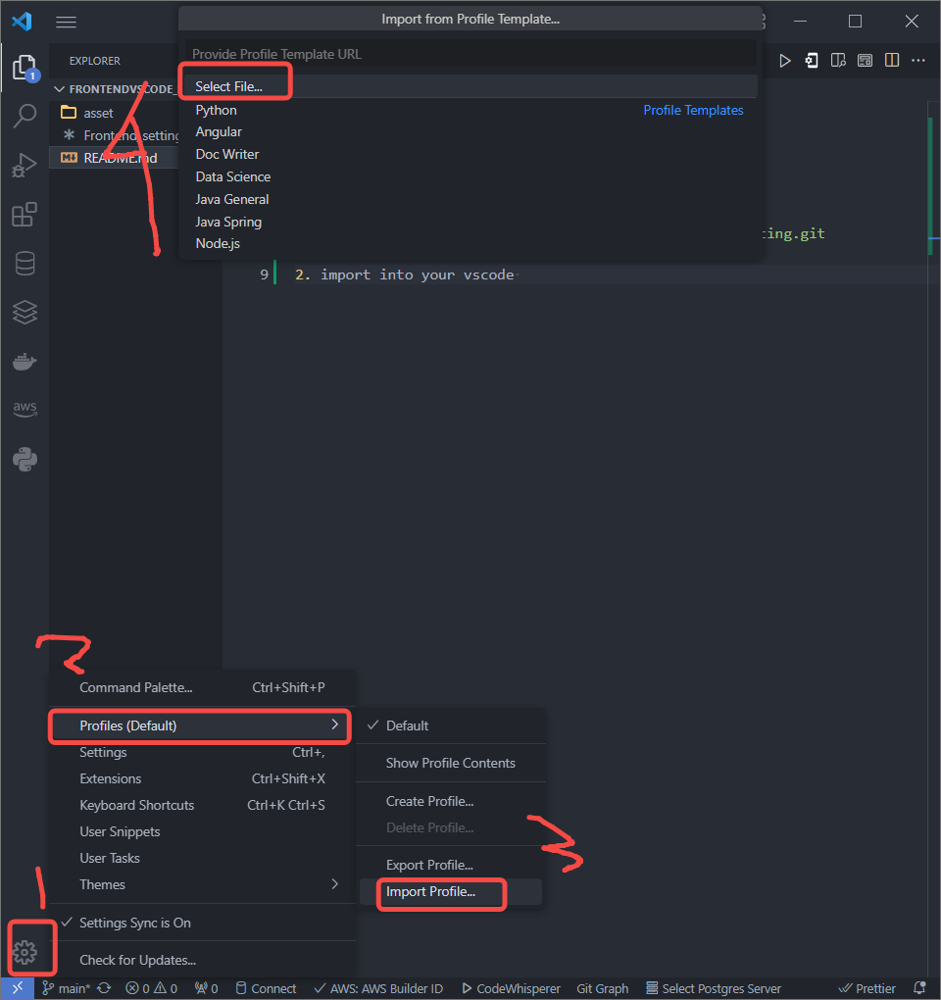
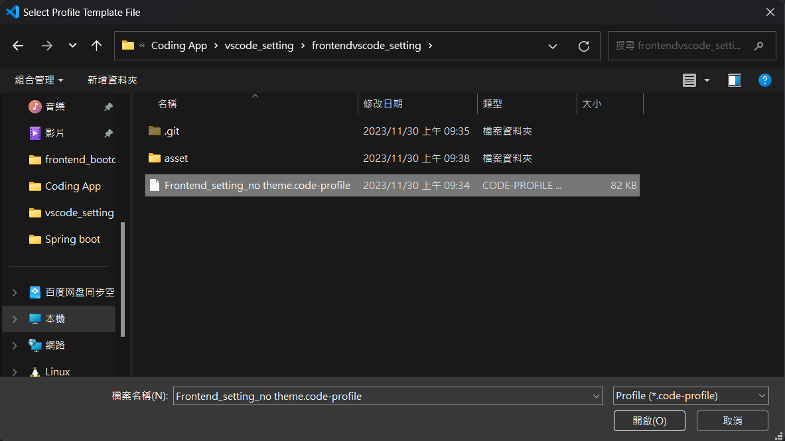
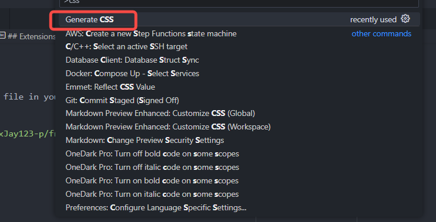
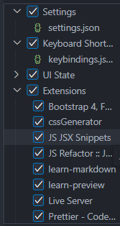

# frontendvscode_setting

## Install of Vscode

1.  git clone or download this file in your local file

```bash

  git clone git@github.com:xxxJay123-p/frontendvscode_setting.git

```

or

download and unzip the file


**[Import]** check the version of vscode and upgrade to 1.8
Help>>About


if your vscode vscode ver is below 1.8,
plz do follow step:
Help>> Check for Update

Help>> Restart to Update


2. import into your vscode, following the step in follow image:
   

3. go to the path of this file u have doownload or clone, and select the file of `.vscode-profile`
   

4. Than is finished, keep coding~~~

## Extensions is include

1. Live Server by RitwickDey

2. Prettier by Prettier

- `ctrl + shift + q` to formated your frontend code

3. Bootstrap 4, Font awesome 4, Font Awesome by Ashok Koyi

4. cssGenerator

- `ctrl + shift +p ` and typing Generator CSS , and enter, you can hv all the css~
- 


